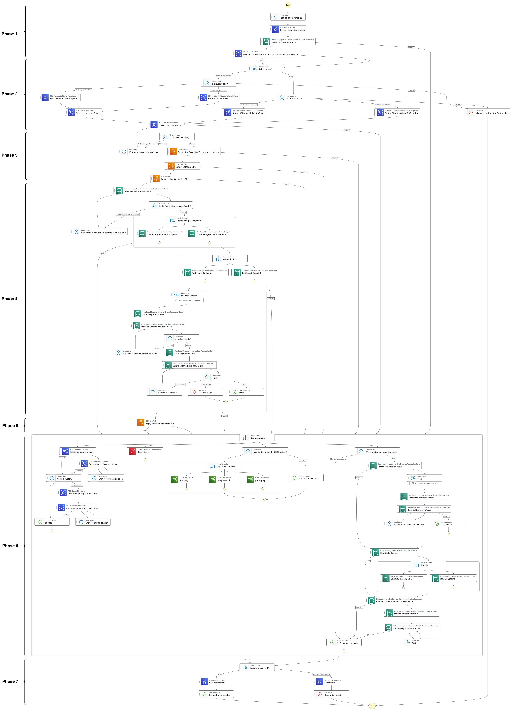

# Workflow AWS Step Functions

<picture>
  
</picture>

La machine d'état AWS Step Functions orchestre un workflow qui coordonne Amazon RDS, AWS DMS, Amazon ECS et des fonctions Lambda pour effectuer l'opération de restauration au niveau base de données et/ou schéma.

La machine d'état gère le cycle de vie complet depuis le provisionnement de base de données temporaire jusqu'à la migration de données et le nettoyage des ressources, avec gestion d'erreurs et logique conditionnelle pour supporter différentes architectures de base de données (instances Amazon RDS ou clusters Amazon Aurora) et méthodes de restauration (Point-in-Time-Recovery vs snapshots). Le processus entier opère via les APIs AWS tout en maintenant le suivi des opérations et les logs.

## Workflow de Restauration (7 Phases)

### Phase 1 : Initialisation & Préparation
La machine d'état commence par valider les paramètres d'entrée et établir des variables globales incluant des identifiants de ressources uniques. Ensuite, elle enregistre la demande de restauration dans une table Amazon DynamoDB pour un suivi d'audit complet, puis détermine l'architecture de base de données en interrogeant RDS pour détecter si la base de production est une instance RDS standard ou un cluster Aurora, les APIs de restaurations étant différentes selon si l'on utilise une base de données Amazon RDS pour PostgreSQL ou un cluster Amazon Aurora PostgreSQL.

Le provisionnement de l'instance de réplication AWS DMS étant une opération longue, la solution l'initie immédiatement pour réduire le temps d'attente global de la restauration.

### Phase 2 : Création d'une Instance Temporaire

Cette phase crée une instance ou un cluster de base de données temporaire dans des sous-réseaux isolés en utilisant soit le Point-in-Time Recovery ou la restauration depuis un snapshot (un paramètre d'entrée de la machine d'état permet de déterminer quelle option utiliser). La base de données temporaire est provisionnée avec les groupes de sécurité appropriés car elle n'est nécessaire que pour l'extraction de données par AWS DMS et l'extraction du DDL par Amazon ECS. Le workflow surveille le processus de provisionnement via des boucles de polling, attendant que la base de données temporaire atteigne le statut "available" avant de procéder à la phase suivante.

### Phase 3 : Extraction et Préparation de Schéma
Une fois la base de données temporaire prête, la step function :
- **Crée un secret temporaire** depuis une AWS Lambda pour la connectivité DMS à la base de données restaurée. AWS DMS utilise AWS Secrets Manager pour l'authentification de base de données Amazon RDS et Amazon Aurora. La lambda détermine d'abord le timestamp cible de la restauration (soit la date de création du snapshot, soit le timestamp PITR spécifié), puis analyse l'historique des versions du secret original pour identifier quelle version était active à ce moment précis. Cette approche garantit que les credentials utilisés correspondent exactement à ceux qui étaient valides au moment des données restaurées, gérant ainsi automatiquement les rotations de mots de passe qui auraient pu avoir lieu entre la sauvegarde et la restauration. Un nouveau secret temporaire est ensuite créé avec ces credentials historiques et en mettant à jour le paramètre host pour pointer vers l'instance de base de données temporaire.
- **Extrait les définitions DDL complètes** incluant tables, contraintes, indexes, séquences, vues, procédures stockées, triggers etc... en utilisant une tâche Amazon ECS spécialisée qui utilise pg_dump. Le DDL extrait est ensuite divisé en deux parties et stocké sur Amazon S3 sous trois formats :
  - **DDL pré-DMS** (tables, clés primaires, séquences) qui est appliqué immédiatement à la base de données de production pour créer les structures essentielles avec des noms de schémas transformés incluant un suffixe temporel (par exemple, le schéma customer_a1 devient customer_a1_20240128143000)
  - **DDL post-DMS** (contraintes, index secondaires, clés étrangères, triggers et tout le reste) qui sera appliqué après la migration des données
  - **DDL complet** conservé comme référence pour audit et troubleshooting

Cette séparation est nécessaire car les contraintes d'intégrité référentielle (comme les clés étrangères) peuvent faire échouer la migration DMS, celui-ci copiant les tables dans un ordre qui ne respecte pas forcément les dépendances entre elles. Bien qu'il soit techniquement possible de déterminer et d'imposer un ordre de migration respectant ces dépendances, cette solution a délibérément choisi de laisser DMS gérer l'ordre des tables afin de simplifier l'implémentation et de maintenir la facilité de maintenance. La migration des données s'effectue donc d'abord sans contraintes, puis toutes les règles d'intégrité sont appliquées une fois le transfert de données terminé.

### Phase 4 : Orchestration de Migration
- Vérifie que l’instance de réplication créée dans la phase 1 est prête
- Crée des endpoints DMS séparés pour les connexions source (base de données temporaire) et cible (base de données de production)
- Le workflow effectue des tests de connexion obligatoires pour valider que les deux endpoints peuvent communiquer avec succès avec leurs bases de données respectives via les secrets AWS Secrets Manager propres à chaque instance avant de procéder à la migration de données
- Traite chaque schéma dans la liste de schémas fournis en entrée de manière concurrente, créant des tâches de réplication DMS individuelles avec des règles de mapping de tables qui sélectionnent seulement les données du schéma spécifié
- Surveille chaque tâche de réplication à travers son cycle de vie complet depuis la création jusqu'à l'exécution et la completion.

### Phase 5 : Application du DDL Post-DMS
- Une fois la migration des données terminée, une tâche Amazon ECS applique le DDL post-DMS pour ajouter tous les éléments structurels omis durant la migration (index secondaires, clés étrangères, contraintes, triggers, vues, procédures stockées), finalisant ainsi l'intégrité et les performances des schémas restaurés.

### Phase 6 : Nettoyage
- Supprime toutes les ressources temporaires en parallèle incluant :
  - Instance ou cluster de base de données temporaire
  - Infrastructure AWS DMS : Tâches, endpoints et instance
  - Secret temporaire dans Amazon Secrets Manager
  - Fichiers DDL stockés dans le bucket S3
- Le processus de nettoyage s'exécute aussi en cas d'échec, prévenant les coûts inutiles
- Le processus de nettoyage s'exécute également en cas d'échec à n'importe quelle étape, prévenant l'accumulation de ressources temporaires et les coûts inutiles.

### Phase 7 : Validation et Journalisation
- La Step Function sauvegarde le statut final de l'opération dans DynamoDB (succès ou échec) avec les détails de l'exécution, puis retourne un statut de completion indiquant le résultat de la restauration. Cette traçabilité permet un audit complet des opérations de restauration et facilite le troubleshooting en cas de problème.

## Paramètres d'Entrée Step Functions

La Step Functions prend en entrée un payload JSON qui définit précisément le périmètre et la source de la restauration. Le format varie selon la méthode de récupération choisie :

### Restauration Point-in-Time Recovery (PITR)
```json
{
  "database": "<databaseName>",
  "schemas": ["<schema1>", "<schema2>", "..."],
  "restoreTime": "2024-01-28T14:30:00Z"
}
```

### Restauration depuis un Snapshot
```json
{
  "database": "<databaseName>",
  "schemas": ["<schema1>", "<schema2>", "..."],
  "snapshotId": "<snapshotId>"
}
```

### Paramètres Obligatoires

| Paramètre | Description | Options |
|-----------|-------------|---------|
| `database` | Nom de la base de données PostgreSQL dans l'instance Amazon RDS ou le cluster Amazon Aurora contenant les données à restaurer | Nom de base de données existante |
| `schemas` | Tableau des noms de schémas à inclure dans la restauration | |
| `restoreTime` OU `snapshotId` | **Soit** timestamp ISO pour PITR **soit** identifiant de snapshot | Doit être dans la fenêtre de rétention des sauvegardes |

