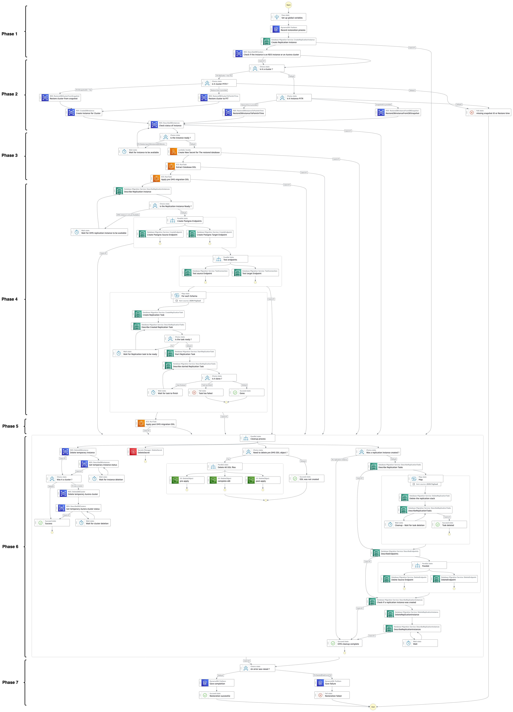

# AWS Step Functions Workflow

<picture>
  
</picture>

The AWS Step Functions state machine orchestrates a workflow that coordinates Amazon RDS, AWS DMS, Amazon ECS, and Lambda functions to perform database and/or schema-level restoration operations.

The state machine manages the complete lifecycle from temporary database provisioning to data migration and resource cleanup, with error handling and conditional logic to support different database architectures (Amazon RDS instances or Amazon Aurora clusters) and restoration methods (Point-in-Time Recovery vs snapshots). The entire process operates via AWS APIs while maintaining operation tracking and logging.

## Restoration Workflow (7 Phases)

### Phase 1: Initialization & Preparation

The state machine begins by validating input parameters and establishing global variables including unique resource identifiers. Then records the restoration request in an Amazon DynamoDB table for complete audit tracking, then determines the database architecture by querying RDS to detect if the production database is a standard RDS instance or Aurora cluster, as restoration APIs differ between Amazon RDS for PostgreSQL and Amazon Aurora PostgreSQL.
Additionally, to improve the overall execution time of the AWS Step Function, the solution starts by creating the AWS DMS replication instance and will check, in phase 4, its readiness.  

### Phase 2: Temporary Instance Creation

- This phase creates a temporary database instance or cluster in isolated subnets using either Point-in-Time Recovery or restoration from snapshot (an input parameter of the state machine determines which option to use)
- The temporary database is provisioned with appropriate security groups as it is only needed for data extraction by AWS DMS and DDL extraction by Amazon ECS. The workflow monitors the provisioning process via polling loops, waiting for the temporary database to reach "available" status before proceeding to the next phase

### Phase 3: DDL Extraction & Preparation

Once the temporary database is ready, the step function:

- **Creates a temporary secret** via AWS Lambda for DMS connectivity to the restored database. AWS DMS uses AWS Secrets Manager for Amazon RDS and Amazon Aurora database authentication. The lambda first determines the target timestamp of the restoration (either the snapshot creation date or the specified PITR timestamp), then analyzes the original secret's version history to identify which version was active at that precise moment. This approach ensures that the credentials used correspond exactly to those that were valid at the time of the restored data, automatically handling password rotations that might have occurred between backup and restoration. A new temporary secret is then created with these historical credentials while updating the host parameter to point to the temporary database instance.
- **Extracts complete DDL definitions** including tables, constraints, indexes, sequences, views, stored procedures, triggers, etc., using a specialized Amazon ECS task that uses pg_dump. The extracted DDL is then split into two parts and stored on Amazon S3 in three formats:
  - **Pre-DMS DDL** (tables, primary keys, sequences) which is immediately applied to the production database to create essential structures with transformed schema names including a temporal suffix (for example, schema customer_a1 becomes customer_a1_20240128143000)
  - **Post-DMS DDL** (constraints, secondary indexes, foreign keys, triggers and everything else) which will be applied after data migration
  - **Complete DDL** preserved as reference for audit and troubleshooting

This separation is necessary because referential integrity constraints (like foreign keys) can cause DMS migration to fail, as it copies tables in an order that doesn't necessarily respect dependencies between them. While it's technically possible to determine and enforce a migration order that respects these dependencies, this solution has deliberately chosen to let DMS manage the table order to simplify implementation and maintain ease of maintenance. Data migration therefore occurs first without constraints, then all integrity rules are applied once data transfer is complete.

### Phase 4: Migration Orchestration

- Provisions DMS infrastructure including a replication instance
- Creates separate DMS endpoints for source (temporary database) and target (production database) connections
- The workflow performs mandatory connection tests to validate that both endpoints can successfully communicate with their respective databases via AWS Secrets Manager secrets before proceeding to data migration
- Processes each schema in the input schema list concurrently, creating individual DMS replication tasks with table mapping rules that select only data from the specified schema
- Monitors each replication task through its complete lifecycle from creation to execution and completion

### Phase 5: Post-DMS DDL Application

- Once data migration is complete, an Amazon ECS task applies the post-DMS DDL to add all structural elements omitted during migration (secondary indexes, foreign keys, constraints, triggers, views, stored procedures), thus finalizing the integrity and performance of the restored schemas.

### Phase 6: Resource Cleanup

- Deletes all temporary resources in parallel including:
  - Temporary database instance or cluster
  - AWS DMS infrastructure: Tasks, endpoints and instance
  - Temporary secret in Amazon Secrets Manager
  - DDL files stored in the S3 bucket
- The cleanup process also runs in case of failure, preventing unnecessary costs
- The cleanup process also executes in case of failure at any step, preventing accumulation of temporary resources and unnecessary costs.

### Phase 7: Validation & Logging

- The Step Function saves the final operation status in DynamoDB (success or failure) with execution details, then returns a completion status indicating the restoration result. This traceability enables complete audit of restoration operations and facilitates troubleshooting in case of problems.

## Step Functions Input Parameters

The Step Functions accepts JSON input that precisely defines the restoration scope and source. The format varies depending on the chosen recovery method:

### Point-in-Time Recovery (PITR)

```json
{
  "database": "<databaseName>",
  "schemas": ["<schema1>", "<schema2>", "..."],
  "restoreTime": "2024-01-28T14:30:00Z"
}
```

### Snapshot-based Recovery

```json
{
  "database": "<databaseName>",
  "schemas": ["<schema1>", "<schema2>", "..."],
  "snapshotId": "<snapshotId>"
}
```

### Required Parameters

| Parameter                     | Description                                                                                                 | Options                                | required |
| ----------------------------- | ----------------------------------------------------------------------------------------------------------- | -------------------------------------- | -------- |
| `database`                    | Name of the PostgreSQL database in the Amazon RDS instance or Aurora cluster containing the data to restore | Any existing database name             | true     |
| `schemas`                     | Array of schema names to include in the restoration                                                         | At least one schema to restore     | true     |
| `restoreTime` OR `snapshotId` | **Either** ISO timestamp for PITR **or** snapshot identifier                                                | Must be within backup retention window | true     |


