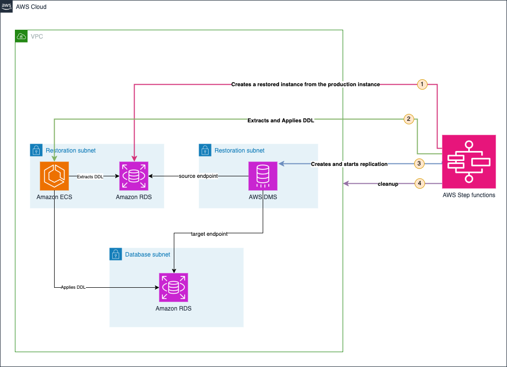

# Restauration au Niveau Base de Données PostgreSQL Multi-Tenant sur AWS

[](https://github.com/aws/mit-0)
[](https://docs.aws.amazon.com/cdk/v2/)

<sub>**Utilisation en Développement/Test Uniquement** : Ce projet est conçu pour les environnements de développement et de test. Les déploiements en production peuvent nécessiter une revue de sécurité supplémentaire, des optimisations de performance et des considérations opérationnelles.</sub>


## Vue d'ensemble

De nombreuses applications adoptent des architectures qui isolent les données de chaque client (appelé aussi tenant) pour des raisons de sécurité, de performance et de conformité. Deux approches courantes sont largement utilisées : l'isolation par instance dédiée où chaque tenant dispose de sa propre instance Amazon Relational Database Service (Amazon RDS) ou cluster Amazon Aurora, et l'isolation par base de données ou schéma dédié où tous les tenants partagent la même instance Amazon RDS ou cluster Amazon Aurora mais disposent chacun de leur propre base de données ou schéma PostgreSQL.

Cette solution résout un défi critique des applications multi-tenant: comment restaurer les données d'un seul tenant sans impacter les autres ?
Les capacités natives d'Amazon RDS opèrent au niveau instance complète, pas au niveau granulaire des schémas individuels. Cette solution apporte une restauration automatisée au niveau schéma en utilisant uniquement les services managés AWS.

- Restaurer des schémas spécifiques sans affecter les autres tenants
- Maintenir les services en ligne pendant la restauration
- Comparer côte-à-côte les données historiques et actuelles
- Nettoyer automatiquement toutes les ressources temporaires

## Architecture



### Services AWS Principaux

La solution s'articule autour de quatre composants AWS principaux qui collaborent pour effectuer une restauration granulaire :

**AWS Step Functions** : agit comme l'orchestrateur central, coordonnant l'ensemble du processus de restauration à travers une machine d'état qui gère le cycle de vie complet : depuis la création d'une base de données restaurée temporaire jusqu'au nettoyage final des ressources, en passant par la validation des paramètres et la gestion des erreurs.

**Amazon Relational Database Service (Amazon RDS)** : il y a deux instances Amazon RDS ou deux clusters Amazon Aurora distincts dans ce processus :
- **Base de données de production** qui contient les données actuelles. C'est l'instance qui contient les schémas que l'on souhaite restaurer, et qui continue de servir les autres tenants en fonctionnement normal pendant toute la durée du processus de restauration.
- **Base de données temporaire** créée spécifiquement pendant et pour la restauration. Cette instance temporaire est générée soit par Point-in-Time Recovery (PITR) soit à partir d'un snapshot de l'instance de production, permettant de récupérer les données à l'état exact souhaité dans le passé. L'instance temporaire, isolée dans des sous-réseaux dédiés, sert uniquement de source d'extraction pour les données historiques, tandis que la base de production continue de fonctionner normalement sans interruption.

**AWS Database Migration Service (AWS DMS)** assure le transfert sélectif des données en copiant uniquement les schémas spécifiés depuis la base de données temporaire vers l'environnement de production. DMS applique des règles de transformation pour renommer les schémas de destination (ajout de suffixes), permettant ainsi une restauration côte-à-côte. Cette approche côte-à-côte est essentielle car la structure des schémas de production a pu évoluer depuis la sauvegarde (ajout de colonnes, modification de contraintes, nouvelles tables), rendant impossible un remplacement direct. La recréation avec un nouveau nom permet une comparaison sécurisée des données historiques sans risquer d'impacter la structure de production actuelle.

**Amazon Elastic Container Service (Amazon ECS)** : exécute des tâches spécialisées pour l'extraction (via pg_dump) et l'application des définitions DDL (Data Definition Language). Ces containers automatisés extraient la structure complète des schémas depuis la base temporaire (tables, contraintes, indexes, séquences, triggers) et recréent cette structure dans la base de production avec de nouveaux noms. Cette étape est essentielle car bien qu'AWS DMS prenne en charge la migration basique de schémas (création de tables et clés primaires), il ne recrée pas automatiquement les index secondaires, les clés étrangères, les contraintes complexes, ou d'autres éléments avancés de structure dans la base de données cible.

## Workflow AWS Step Functions

Pour des informations détaillées sur le workflow AWS Step Functions, voir : **[Documentation du flux de travail Step Functions](./README-AWS-SF-fr.md)**

## Ce que la Solution Déploie

La solution crée un environnement PostgreSQL multi-tenant complet pour tester et démontrer les capacités de restauration au niveau schéma. Cela inclut à la fois l'infrastructure AWS et une structure de base de données réaliste qui simule une application SaaS de production.

### Infrastructure AWS

**Infrastructure Réseau :**
- **Amazon VPC** avec des sous-réseaux publics et privés dédiés (2 publics, 2 privés pour la base de données de production, 2 privés pour le processus de restauration)
- **VPC Endpoints** pour l'accès privé aux services AWS (Secrets Manager, S3, CloudWatch, Step Functions, etc.)
- **Groupes de Sécurité** avec des règles d'accès à privilèges minimaux pour la base de données,les tâches ECS, et les lambdas

**Ressources de Base de Données :**
- **Amazon RDS PostgreSQL ou Amazon Aurora** instance avec la configuration sélectionnée
- **AWS Secrets Manager** avec des credentials de base de données chiffrés et support de rotation automatique
- **Génération continue de données** via AWS Lambda créant de nouveaux enregistrements chaque minute pour simuler une activité d'application réelle

**Services d'Orchestration Principaux :**
- **AWS Step Functions** avec une machine d'état de restauration pré-configurée
- **Cluster Amazon ECS** et définitions de tâches Fargate pour l'extraction et l'application DDL
- **Infrastructure AWS DMS** incluant groupes de sécurité, groupes de sous-réseaux, et rôles IAM de service
- **Bucket Amazon S3** pour le stockage temporaire des scripts DDL pendant les restaurations avec politiques de cycle de vie

**Gestion et Surveillance :**
- **Table DynamoDB** pour l'historique des opérations de restauration et le suivi d'audit
- **Logs CloudWatch** pour tous les composants de service avec politiques de rétention appropriées

**Fonctions Lambda :**
- **Create Secret Lambda** : crée des secrets temporaires avec les credentials historiques appropriés pour la connectivité DMS
- **Init Database Lambda** : initialise la structure de la base de données lors du déploiement (schémas, tables, données d'exemple)
- **Simulate Activity Lambda** : génère en continu de nouvelles données pour simuler l'activité d'une application réelle

### Types de Base de Données Supportés

La solution supporte plusieurs options de déploiement PostgreSQL :

| Valeur de Contexte | Type de Base de Données | Configuration | Cas d'Usage |
|-------------------|------------------------|---------------|-------------|
| `SingleAz` | RDS PostgreSQL Single-AZ | db.t4g.micro, stockage 20GB | Environnements de développement, test |
| `MultiAz` | RDS PostgreSQL Multi-AZ | db.t4g.micro, stockage 20GB | Charges de travail de production nécessitant HA |
| `AuroraProvisioned` | Aurora PostgreSQL | instance writer db.t4g.medium | Charges de travail de production haute performance |
| `AuroraServerless` | Aurora Serverless v2 | auto-scaling 0.5-1 ACU | Charges de travail variables ou imprévisibles |

### Structure de Base de Données Multi-Tenant

La solution déployée implémente un pattern d'**isolation schéma-par-tenant** avec deux niveaux d'organisation :

#### Organisation des Bases de Données et Schémas

| Base de Données | Schémas | Objectif |
|-----------------|---------|----------|
| `tenant_a` | `customer_a1`, `customer_a2` | Environnements clients du Tenant A |
| `tenant_b` | `customer_b1`, `customer_b2` | Environnements clients du Tenant B |
| `postgres` | `public` | Base de données système (PostgreSQL par défaut) |

#### Structure de Tables par Schéma

Chaque schéma client contient des structures de tables identiques avec des données d'exemple pour tester les capacités de restauration :

| Table | Description |
|-------|-------------|
| **users** | Comptes utilisateurs d'exemple avec divers types de données (JSONB, enums, timestamps) |
| **products** | Enregistrements de produits avec arrays, attributs JSONB, et données d'inventaire |
| **orders** | Enregistrements de commandes démontrant les relations de clés étrangères |
| **order_items** | Articles de ligne de commande montrant des relations de tables complexes |

#### Fonctionnalités PostgreSQL Avancées

- **Séquences** : séquences personnalisées pour les IDs utilisateur et numéros de commande
- **Fonctions** : génération de codes utilisateur et triggers de mise à jour de timestamp
- **Index** : optimisation de performance sur les colonnes fréquemment interrogées
- **Contraintes** : clés étrangères, contraintes uniques, et contraintes de vérification
- **Row Level Security** : politiques d'isolation des données tenant
- **Vues** : vues de reporting agrégées pour l'analyse utilisateur et produit

## Gestion des schémas après restauration

Après une restauration réussie, la solution crée de nouveaux schémas avec des suffixes horodatés (par exemple, `customer_a1_1706443800000`) contenant les données restaurées. Ces schémas coexistent avec vos schémas de production originaux, permettant une comparaison et une validation sécurisées.

Après avoir confirmé que les données restaurées répondent à vos besoins, vous avez plusieurs options :

1. **Remplacer les schémas de production :** Renommer les schémas pour promouvoir les données restaurées en production (par exemple, en utilisant une tâche Amazon ECS ou une fonction AWS Lambda)
2. **Planifier la suppression des schémas originaux :** Les schémas inutilisés consomment de l'espace de stockage de la base de données et génèrent des coûts continus. Cependant, supprimer de gros schémas peut être gourmand en ressources et impacter les performances de la base de données. Choisissez votre stratégie de suppression en fonction de :

   **Supprimer immédiatement quand :**
   - Les schémas contiennent peu de données (suppression rapide)
   - L'impact sur les ressources (comme les IOPS) est minimal
   - Les coûts de stockage sont une préoccupation principale
   
   **Planifier pour plus tard quand :**
   - Les schémas contiennent de grandes quantités de données (suppression gourmande en ressources)
   - L'instance de base de données est actuellement sous forte charge
   - Vous devez éviter l'impact sur les performances pendant les heures de travail
   
   Considérez l'implémentation de la suppression pendant les fenêtres de maintenance programmées ou les périodes de faible trafic pour minimiser l'impact opérationnel.

3. **Redéployer les workloads pour utiliser les schémas restaurés :** Mettre à jour les configurations d'application, les chaînes de connexion ou les manifestes de déploiement pour pointer vers le nouveau schéma restauré au lieu de le renommer. Cette approche :
   - Permet des modèles de déploiement 'Blue-Green' au niveau du schéma
   - Simplifie le roolback si des problèmes sont découverts plus tard (les deux schémas coexistent pendant la transition)
   
   Après validation du bon fonctionnement des workloads, programmer la suppression du schéma de production original afin d'optimiser les ressources

## Déployer la Solution

### Prérequis

Avant de déployer la solution de restauration au niveau base de données, assurez-vous d'avoir :

- **Compte AWS** avec des permissions administratives
- **AWS CLI** v2.0+ configuré
- **Node.js** (version 18 ou ultérieure) et npm
- **AWS CDK** CLI (version 2 ou supérieure)
- **Docker** fonctionnant localement pour le packaging des tâches Amazon ECS

### Étapes de Déploiement

**Clonez le repository :**
```bash
git clone https://github.com/aws-samples/sample-multitenant-database-recovery.git
cd sample-multitenant-database-recovery.git
```

**Buildez le projet :**
```bash
npm install
npm run build
```

**Déployez le projet :**

Si vous n'avez pas déjà lancé le bootstrap de l'environnement AWS:

```bash
cdk bootstrap
```

ensuite:

```bash
cdk deploy DatabaseLevelRestoreStack --context selectedDatabase=AuroraServerless
```

Avec Aurora Serverless, vous pouvez utiliser [Aurora query editor](https://docs.aws.amazon.com/AmazonRDS/latest/AuroraUserGuide/query-editor.html) pour éxécuter des requêtes SQL depuis la console AWS et vérifier le bon déroulement de la migration.


### Pour Lancer une Restauration

**1. Accédez à la Console AWS :**
Naviguez vers "Step Functions" dans la Console AWS où la solution est déployée.

**2. Démarrez l'Exécution :**
Trouvez et cliquez sur la machine d'état déployée, puis cliquez sur "Start execution".

**3. Fournissez l'Entrée :**
Fournissez une entrée basée sur votre stratégie désirée. Par exemple, pour la solution déployée :

Pour Point-in-Time Recovery :
```json
{
  "database": "tenant_a",
  "schemas": ["customer_a1", "customer_a2"],
  "restoreTime": "2024-01-28T14:30:00Z"
}
```

Remplacez "2024-01-28T14:30:00Z" par une date de restauration PITR valide.

Pour une récupération basée sur un snapshot :
```json
{
  "database": "tenant_a",
  "schemas": ["customer_a1", "customer_a2"],
  "snapshotId": "<snapshotId>"
}
```

**4. Surveillez l'Exécution :**
Attendez la complétion de la State Machine.

**5. Visualisez les Résultats :**
Une fois terminée, la solution crée un nouveau schéma de récupération nommé par exemple `customer_a1_1706443800000` (le suffixe est un timestamp) dans la base de données de production, contenant les données migrées depuis l'instance de base de données temporaire restaurée. AWS DMS copie toutes les données des tables des schémas sélectionnés dans la base de données temporaire vers de nouveaux schémas de récupération dans l'environnement de production, permettant une comparaison côte à côte avec les schémas originaux sans écraser ou affecter les données de production existantes.

**6. Gestion des schémas (après validation) :**

Après avoir validé les données restaurées, choisissez votre stratégie de gestion selon vos besoins :

D'abord, renommez le schéma actuel (par mesure de sécurité avant le remplacement) :
```sql
ALTER SCHEMA customer_a1 RENAME TO customer_a1_todelete;
```

Ensuite, renommez le schéma restauré avec le nom de production (remplacez `customer_a1_1706443800000` par le nom réel de votre schéma restauré) :
```sql
ALTER SCHEMA customer_a1_1706443800000 RENAME TO customer_a1;
```

Vérifiez le changement :
```sql
SELECT schema_name FROM information_schema.schemata WHERE schema_name LIKE 'customer_a1%';
```

**Option A : Supprimer immédiatement l'ancien schéma de production :**

```sql
DROP SCHEMA customer_a1_todelete CASCADE;
```

**Option B : Planifier le nettoyage**

Les deux schémas coexistent maintenant. Planifiez la suppression du schéma 'customer_a1_todelete' en utilisant par exemple [Amazon EventBridge Scheduler](https://aws.amazon.com/eventbridge/features/) pour [déclencher une tâche Amazon ECS](https://docs.aws.amazon.com/AmazonECS/latest/developerguide/tasks-scheduled-eventbridge-scheduler.html) ou [déclencher une fonction Amazon Lambda](https://docs.aws.amazon.com/eventbridge/latest/userguide/eb-run-lambda-schedule.htm

## Coût de la Solution

Ce coût est estimé pour la région de Paris (eu-west-3).

### Coût de l'Infrastructure Déployée

**Amazon RDS ou Amazon Aurora :** selon le type de base de données sélectionné lors du déploiement

| Type de Base de Données | Configuration | Coût Mensuel | Coût Horaire |
|------------------------|---------------|--------------|--------------|
| **Amazon RDS PostgreSQL Single-AZ** | db.t4g.micro, stockage 20 GB | 15,80€ | ~0,022€ |
| **Amazon RDS PostgreSQL Multi-AZ** | db.t4g.micro, stockage 20 GB | 31,60€ | ~0,043€ |
| **Amazon Aurora Provisioned** | 1 instance writer : db.t4g.medium | 59,97€ | ~0,082€ |
| **Amazon Aurora Serverless** | Min: 0,5 ACU, Max: 1 ACU | 51,10€ | ~0,070€ |

**Instance Amazon EC2 :** éligible au Free Tier

**Amazon VPC Endpoints :**
- 10 VPC endpoints × 2 ENIs par endpoint × 0,011€ = 0,22€ par heure

### Coût par Restauration

**AWS Step Functions :**
- AWS Step Functions workflow standard facture à la transition d'état. En moyenne, selon le temps d'attente dans les boucles polling pour que l'état des ressources passe à "available", on utilise 800 transitions d'état
- **Coût par exécution :** 0,025€

**AWS DMS :**
- AWS DMS est facturé uniquement durant le temps de restauration
- L'instance déployée dans la solution est une dms.t3.medium avec 20Gb de stockage
- Pour cette solution, un processus de restauration dure en moyenne 35min avec la phase de copie de données qui dure en moyenne 20min
- **Coût par exécution :** 0,028€
- *Formule de calcul : [(1 instance × 0,082€ horaire) + (20 GB × 0,12 mensuel) / 730 heures] / 60minutes) × 20minutes*

**Amazon S3 :** 0,00€ par exécution (couvert par le free tier)

**Amazon DynamoDB :** 0,00€ par exécution (couvert par le free tier)

**Coût par 1000 exécutions : ~55€**

## Nettoyage

Pour éviter d'encourir des charges, supprimez la solution en utilisant :

```bash
cdk destroy DatabaseLevelRestoreStack
```

## Améliorations Possibles

Bien que la solution actuelle fournisse des capacités complètes de restauration au niveau base de données et schéma pour PostgreSQL, plusieurs améliorations pourraient davantage améliorer sa fonctionnalité et sa valeur opérationnelle :

### Support Multi-Engine de Base de Données
L'architecture peut être étendue pour supporter des moteurs de base de données additionnels incluant MySQL, SQL Server, Oracle, et autres bases de données compatibles RDS. Cette expansion nécessiterait une logique d'extraction DDL spécifique au moteur et des templates de configuration DMS, mais les patterns d'orchestration de workflow et de gestion de ressources restent cohérents à travers les plateformes de base de données.

### Système de Notification Amélioré
Les notifications automatisées via une intégration avec Amazon Simple Notification Service (Amazon SNS) pourraient fournir des mises à jour en temps réel sur le progrès des opérations de restauration et le statut de completion.

### Granularité au Niveau Table
Étendre les capacités de restauration au niveau table fournirait un contrôle encore plus fin sur les opérations de récupération de données. Cette amélioration modifierait les règles de mapping de tables DMS pour cibler des tables spécifiques dans les schémas tout en maintenant l'intégrité référentielle via l'analyse de dépendances. Les administrateurs de base de données pourraient restaurer des tables corrompues sans affecter les données liées, réduisant le temps de restauration et minimisant la portée de validation de données requise post-restauration.

### Intégration DMS Serverless
Implémenter DMS Serverless éliminerait le besoin de planification de capacité. La solution pourrait provisionner dynamiquement la capacité DMS basée sur le volume de données actuel et la complexité de migration, fournissant un scaling automatique pour les grandes opérations de restauration tout en maintenant l'efficacité des coûts pour les tâches plus petites. Cette approche serait particulièrement bénéfique pour les organisations avec des patterns de restauration imprévisibles ou des tailles de base de données tenant variables.

### Validation de Données Automatisée
Les vérifications d'intégrité de données post-restauration pourraient automatiquement valider la précision de la restauration. Ces vérifications automatisées compareraient les données source et cible à la completion, générant des rapports de validation détaillés et signalant toute discordance pour révision. Des règles de validation personnalisées pourraient être configurées par tenant ou schéma pour vérifier des relations de données et contraintes spécifiques au business.

### Système de Rollback Intelligent
Les capacités de rollback automatique fourniraient des mécanismes de sécurité pour les opérations de restauration échouées ou corrompues. Si les vérifications de validation de données échouent ou des erreurs critiques surviennent pendant le processus de restauration, le système pourrait automatiquement supprimer les schémas de récupération et alerter les administrateurs sans intervention manuelle. Cette amélioration inclurait des triggers de rollback configurables, des procédures de nettoyage complètes, et un logging détaillé pour supporter le troubleshooting et les efforts d'amélioration de processus.

## Conclusion

Les capacités de restauration au niveau base de données adressent un gap critique dans les architectures d'applications multi-tenant. En combinant les services managés AWS dans un workflow orchestré, les organisations peuvent atteindre une récupération granulaire de données sans la complexité et l'overhead des solutions personnalisées.

Cette approche transforme la récupération de données d'un processus réactif et manuel en une capacité proactive et automatisée qui réduit la complexité opérationnelle. La solution tire parti de la fiabilité et de la scalabilité des services AWS tout en fournissant le contrôle granulaire nécessaire pour les applications multi-tenant modernes.

En implémentant cette solution, vous permettez une réponse rapide aux demandes de récupération de données client tout en maintenant les standards de sécurité, conformité, et excellence opérationnelle requis pour les environnements de production.

## Ressources de Documentation

- [Amazon Relational Database Service (Amazon RDS)](https://aws.amazon.com/fr/rds/features/?nc1=h_ls)
- [Amazon Aurora](https://docs.aws.amazon.com/fr_fr/AmazonRDS/latest/AuroraUserGuide/CHAP_AuroraOverview.html)
- [AWS Database Migration Service (AWS DMS)](https://aws.amazon.com/fr/dms/features/)
- [Amazon Elastic Container Service (Amazon ECS)](https://aws.amazon.com/fr/ecs/features/)
- [AWS Step Functions](https://aws.amazon.com/fr/step-functions/features/)
- [AWS Secrets Manager](https://aws.amazon.com/fr/secrets-manager/features/)


## Signalement de Problèmes
Pour les rapports de bugs et demandes de fonctionnalités, veuillez créer des issues GitHub détaillées avec :
- Description claire du problème et comportement attendu
- Messages d'erreur complets et stack traces
- Logs CloudWatch pertinents et détails d'exécution
- Informations de région AWS et compte (anonymisées)
- Étapes pour reproduire le problème

## Licence

Ce projet est sous licence MIT-0. Voir le fichier [LICENSE](LICENSE) pour les détails.

---

**Construit par l'Équipe Architecture de Solutions AWS**