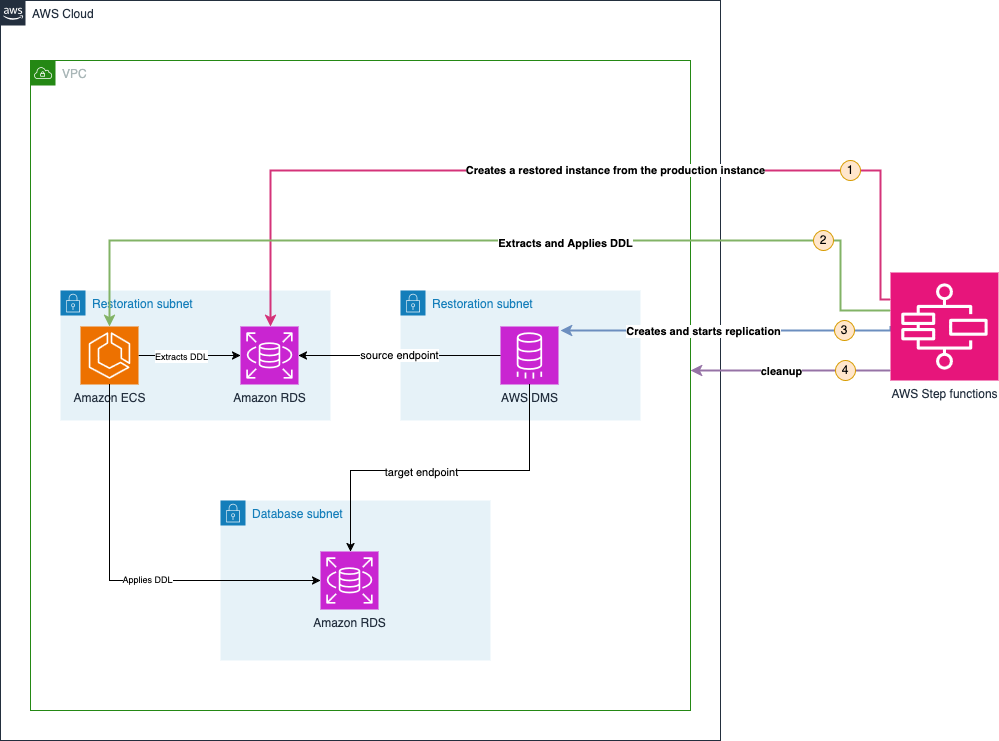

# Multi-Tenant PostgreSQL Database-Level Recovery on AWS

[](https://github.com/aws/mit-0)
[](https://docs.aws.amazon.com/cdk/v2/)

<div align="right">
🇫🇷 <a href="./README-fr.md">Version française</a>
</div>

---

<sub>**Development/Testing Use Only**: This project is designed for development and testing environments. Production deployments may require additional security hardening, performance optimizations, and operational considerations.</sub>

## Overview

Multi-tenant applications commonly implement data isolation strategies to meet security, performance, and compliance requirements. Two prevalent approaches are instance-per-tenant isolation, where each tenant operates within a dedicated Amazon Relational Database Service (Amazon RDS) instance or an Amazon Aurora cluster, and schema-per-tenant isolation, where tenants share database infrastructure while maintaining logical separation through distinct PostgreSQL databases or schemas.

The schema-per-tenant approach provides operational efficiency and cost optimization while ensuring strict logical data separation. However, this architecture presents a significant operational constraint: Amazon RDS native backup and restore capabilities operate exclusively at the database instance level, not at the granular level of individual databases or schemas.

When tenant-specific data recovery becomes necessary, this limitation creates operational challenges. Organizations must choose between restoring entire database instances (affecting all tenants) or implementing complex manual extraction processes.

### Solution Approach

This solution provides automated database restoration capabilities for multi-tenant PostgreSQL databases running on AWS RDS and Aurora. It implements **schema-level recovery** using AWS managed services:

- **Schema-level granularity** for individual tenant restoration
- **Side-by-side recovery** without overwriting production data
- **Automated orchestration** via Step Functions workflow
- **Point-in-Time Recovery (PITR)** and **snapshot-based** restoration options
- **Zero-downtime** operations for unaffected tenants

## Architecture

### High-Level Components



### Core AWS Services

The solution is built around four main AWS components that collaborate to perform granular restoration:

**AWS Step Functions**: Acts as the central orchestrator, coordinating the entire restoration process through a state machine that manages the complete lifecycle: from creating a temporary restored database to final resource cleanup, including parameter validation and error handling.

**Amazon RDS**: There are two distinct Amazon RDS instances or Amazon Aurora clusters in this process:

- **Production Database**: Contains current data. This is the instance that contains the schemas we want to restore, and continues to serve other tenants in normal operation throughout the restoration process.
- **Temporary Database**: Created specifically during and for restoration. This temporary instance is generated either by Point-in-Time Recovery (PITR) or from a snapshot of the production instance, allowing recovery of data to the exact desired state in the past. The temporary instance, isolated in dedicated subnets, serves only as an extraction source for historical data, while the production database continues to function normally without interruption.

**AWS Database Migration Service (AWS DMS)**: Ensures selective data transfer by copying only specified schemas from the temporary database to the production environment. DMS applies transformation rules to rename destination schemas (adding suffixes), thus enabling side-by-side restoration. This side-by-side approach is essential because the production schema structure may have evolved since the backup (column additions, constraint modifications, new tables), making direct replacement impossible. Recreation with a new name allows safe comparison of historical data without risking impact to the current production structure.

**Amazon Elastic Container Service (Amazon ECS)**: Executes specialized tasks for DDL extraction (via pg_dump) and application of Data Definition Language definitions. These automated containers extract the complete schema structure from the temporary database (tables, constraints, indexes, sequences, triggers) and recreate this structure in the production database with new names. This step is essential because while AWS DMS supports basic schema migration (table creation and primary keys), it does not automatically recreate secondary indexes, foreign keys, complex constraints, or other advanced structural elements in the target database.

## AWS Step Functions Workflow

This solution uses AWS Step Functions to orchestrate the complete restoration process through a state machine that coordinates Amazon RDS, AWS DMS, Amazon ECS, and Lambda functions.

For detailed information about the Step Functions workflow, including the state machine diagram and complete phase-by-phase breakdown, see: **[Step Functions Workflow Documentation](./README-AWS-SF.md)**

## What the Solution Deploys

The solution creates a comprehensive multi-tenant PostgreSQL environment for testing and demonstrating schema-level restoration capabilities. This includes both AWS infrastructure and a realistic database structure that simulates a production SaaS application.

### AWS Infrastructure

**Network Infrastructure:**

- **Amazon VPC** with dedicated public and private subnets (2 public, 2 private for production database, 2 private for restoration process)
- **VPC Endpoints** for private access to AWS services (Secrets Manager, S3, CloudWatch, Step Functions, etc.)
- **Security Groups** with least-privilege access rules for database, ECS tasks, and Lambdas

**Database Resources:**

- **Amazon RDS PostgreSQL or Amazon Aurora** instance with your selected configuration
- **AWS Secrets Manager** with encrypted database credentials and automatic rotation support
- **Continuous data generation** via AWS Lambda creating new records every minute to simulate real application activity

**Core Orchestration Services:**

- **AWS Step Functions** with pre-configured restoration state machine
- **Amazon ECS cluster** and Fargate task definitions for DDL extraction and application
- **AWS DMS infrastructure** including security groups, subnet groups, and IAM service roles
- **Amazon S3 bucket** for temporary DDL script storage during restorations with lifecycle policies

**Management and Monitoring:**

- **DynamoDB table** for restoration operation history and audit tracking
- **CloudWatch logs** for all service components with appropriate retention policies

**Lambda Functions:**

- **Create Secret Lambda**: Creates temporary secrets with appropriate historical credentials for DMS connectivity
- **Init Database Lambda**: Initializes database structure during deployment (schemas, tables, sample data)
- **Simulate Activity Lambda**: Continuously generates new data to simulate real application activity

### Supported Database Types

The solution supports multiple PostgreSQL deployment options:

| Context Value         | Database Type            | Configuration                 |
| --------------------- | ------------------------ | ----------------------------- |
| `SingleAz`          | RDS PostgreSQL Single-AZ | db.t4g.micro, 20GB storage    |
| `MultiAz`           | RDS PostgreSQL Multi-AZ  | db.t4g.micro, 20GB storage    |
| `AuroraProvisioned` | Aurora PostgreSQL        | db.t4g.medium writer instance |
| `AuroraServerless`  | Aurora Serverless v2     | 0.5-1 ACU auto-scaling        |

### Multi-Tenant Database Structure

The deployed solution implements a **schema-per-tenant isolation** pattern with two levels of organization:

#### Database and Schema Organization

| Database   | Schemas                      | Purpose                              |
| ---------- | ---------------------------- | ------------------------------------ |
| `tenant_a` | `customer_a1`, `customer_a2` | Tenant A's customer environments     |
| `tenant_b` | `customer_b1`, `customer_b2` | Tenant B's customer environments     |
| `postgres` | `public`                     | System database (PostgreSQL default) |

#### Table Structure per Schema

Each customer schema contains identical table structures with sample data for testing restoration capabilities:

| Table           | Description                                                             |
| --------------- | ----------------------------------------------------------------------- |
| **users**       | Sample user accounts with various data types (JSONB, enums, timestamps) |
| **products**    | Product records with arrays, JSONB attributes, and inventory data       |
| **orders**      | Order records demonstrating foreign key relationships                   |
| **order_items** | Order line items showing complex table relationships                    |

#### Advanced PostgreSQL Features

- **Sequences**: Custom sequences for user IDs and order numbers
- **Functions**: User code generation and timestamp update triggers
- **Indexes**: Performance optimization on frequently queried columns
- **Constraints**: Foreign keys, unique constraints, and check constraints
- **Row Level Security**: Tenant data isolation policies
- **Views**: Aggregated reporting views for user and product analytics

## Post-Restoration Schema Management

After successful restoration, the solution creates new schemas with timestamp suffixes (e.g., `customer_a1_1706443800000`) containing the restored data. These schemas exist alongside your original production schemas, enabling safe comparison and validation.

After confirming the restored data meets your needs, you have several options:

1. **Replace Production Schemas:** Rename schemas to promote restored data to production (For example, using an Amazon ECS Task or an AWS Lambda function)
2. **Schedule original schemas for deletion:** Unused schemas consume database storage and incur ongoing costs. However, dropping large schemas can be resource-intensive and impact database performance. Choose your deletion strategy based on:

   **Delete immediately when:**
   - Schemas contain minimal data (fast deletion)
   - Impact on resources (like IOPS) is minimal
   - Storage costs are a primary concern
   
   **Schedule for later when:**
   - Schemas contain large amounts of data (resource-intensive deletion)
   - Database instance is currently under heavy load
   - You need to avoid performance impact during business hours
   
   Consider implementing deletion during scheduled maintenance windows or low-traffic periods to minimize operational impact.
3. **Redeploy workloads to use restored schemas:** Update application configurations, connection strings, or deployment manifests to point to the new restored schema instead of renaming. Once the . This approach:
   - Enables blue-green deployment patterns at the schema level
   - Simplifies rollback if issues are discovered later (both schemas coexist during the shift)

   Once workloads are operating successfully, schedule the original schema for deletion to free up resources
   
## Deploy the Solution

### Prerequisites

Before deploying the database-level restoration solution, ensure you have:

- **AWS Account** with right level of permissions
- **AWS CLI** v2.0+ configured
- **Node.js** (version 18 or later) and npm
- **AWS CDK** CLI (version 2 or later)
- **Docker** running locally for ECS container packaging

### Deployment Steps

**Clone the repository:**

```bash
git clone https://github.com/aws-samples/sample-multitenant-database-recovery.git
cd sample-multitenant-database-recovery
```

**Build the project:**

```bash
npm install
npm run build
```

**Deploy the project:**

if not already done, run cdk boostrap

```bash
cdk bootstrap
```

```bash
cdk deploy DatabaseLevelRestoreStack --context selectedDatabase=AuroraServerless
```

Using Aurora Serverless, you can use [Aurora query editor](https://docs.aws.amazon.com/AmazonRDS/latest/AuroraUserGuide/query-editor.html) to execute queries from the AWS console to check the recovery execution.

### To Launch a Restoration

**1. Access AWS Console:**
Navigate to "Step Functions" in the AWS Console where the solution is deployed.

**2. Start Execution:**
Find and click on the deployed state machine, then click "Start execution".

**3. Provide Input:**
Supply input based on your desired strategy. For example, for the deployed solution:

For Point-in-Time Recovery:

```json
{
  "database": "tenant_a",
  "schemas": ["customer_a1", "customer_a2"],
  "restoreTime": "2024-01-28T14:30:00Z"
}
```

Replace "2024-01-28T14:30:00Z" with a valid PITR restoration date.

For snapshot-based recovery:

```json
{
  "database": "tenant_a",
  "schemas": ["customer_a1", "customer_a2"],
  "snapshotId": "rds:snapshot-xxxxx"
}
```

Replace "rds:snapshot-xxxxx" with a valid snapshot ID restoration date.

**4. Monitor Execution:**
Wait for the State Machine to complete.

**5. View Results:**
Once finished, the solution creates a new recovery schema named, for example, `customer_a1_1706443800000` (the suffix is a timestamp) in the production database, containing data migrated from the temporary restored database instance. AWS DMS copies all data from tables in the selected schemas from the temporary database to new recovery schemas in the production environment, enabling side-by-side comparison with original schemas without overwriting or affecting existing production data.

You can view the results throughs Aurora query editor from the AWS console.

**6. Schema Management (Post-Validation):**

After validating the restored data, choose your management strategy based on your needs:

First, rename current production schema for deletion (as a safety measure before replacement)::
```sql
ALTER SCHEMA customer_a1 RENAME TO customer_a1_todelete;
```

Then rename restored schema to production name (replace `customer_a1_1706443800000` with your actual restored schema name):
```sql
ALTER SCHEMA customer_a1_1706443800000 RENAME TO customer_a1;
```

Verify the change:
```sql
SELECT schema_name FROM information_schema.schemata WHERE schema_name LIKE 'customer_a1%';
```

**Option A: Immediately drop the old production schema:**

```sql
DROP SCHEMA customer_a1_todelete CASCADE;
```

**Option B: Schedule cleanup**

Both schemas now coexist. Schedule deletion of schema 'customer_a1_todelete' using for example [Amazon EventBridge Scheduler](https://aws.amazon.com/eventbridge/features/) to [trigger an Amazon ECS task](https://docs.aws.amazon.com/AmazonECS/latest/developerguide/tasks-scheduled-eventbridge-scheduler.html) or [to trigger an Amazon Lambda function](https://docs.aws.amazon.com/eventbridge/latest/userguide/eb-run-lambda-schedule.html)

## Solution Cost

This cost is estimated for the Paris region (eu-west-3).

### Deployed Infrastructure Cost

**Amazon RDS or Amazon Aurora:** Depending on the database type selected during deployment

| Database Type                       | Configuration                    | Monthly Cost | Hourly Cost |
| ----------------------------------- | -------------------------------- | ------------ | ----------- |
| **Amazon RDS PostgreSQL Single-AZ** | db.t4g.micro, 20 GB storage      | $15.80       | ~$0.022     |
| **Amazon RDS PostgreSQL Multi-AZ**  | db.t4g.micro, 20 GB storage      | $31.60       | ~$0.043     |
| **Amazon Aurora Provisioned**       | 1 writer instance: db.t4g.medium | $59.97       | ~$0.082     |
| **Amazon Aurora Serverless**        | Min: 0.5 ACU, Max: 1 ACU         | $51.10       | ~$0.070     |

**Amazon EC2 Instance:** Free Tier eligible

**Amazon VPC Endpoints:**

- 10 VPC endpoints × 2 ENIs per endpoint × $0.011 USD = $0.22 per hour

### Cost per Restoration

**AWS Step Functions:**

- AWS Step Functions standard workflow charges per state transition. On average, depending on wait time in polling loops for resources to reach "available" status, uses 800 state transitions
- **Cost per execution:** $0.025

**AWS DMS:**

- AWS DMS is charged only during restoration time
- The deployed instance is a dms.t3.medium with 20GB storage
- For this solution, a restoration process takes an average of 35 minutes with the data copy phase lasting an average of 20 minutes
- **Cost per execution:** $0.028
- _Calculation formula: [(1 instance × $0.082 USD hourly) + (20 GB × 0.12 monthly) / 730 hours] / 60 minutes) × 20 minutes_

**Amazon S3:** $0.00 per execution (covered by free tier)

**Amazon DynamoDB:** $0.00 per execution (covered by free tier)

**Cost per 1000 executions: ~$55**

## Cleanup

To avoid incurring charges, delete the solution using:

```bash
cdk destroy DatabaseLevelRestoreStack
```

## Possible Improvements

While the current solution provides complete database and schema-level restoration capabilities for PostgreSQL, several improvements could further enhance its functionality and operational value:

### Multi-Engine Database Support

The architecture can be extended to support additional database engines including MySQL, SQL Server, Oracle, and other RDS-compatible databases. This expansion would require engine-specific DDL extraction logic and DMS configuration templates, but the workflow orchestration and resource management patterns remain consistent across database platforms.

### Enhanced Notification System

Automated notifications via Amazon Simple Notification Service (Amazon SNS) integration could provide real-time updates on restoration operation progress and completion status.

### Table-Level Granularity

Extending restoration capabilities to the table level would provide even finer control over data recovery operations. This enhancement would modify DMS table mapping rules to target specific tables within schemas while maintaining referential integrity via dependency analysis. Database administrators could restore corrupted tables without affecting related data, reducing restoration time and minimizing the scope of post-restoration data validation required.

### DMS Serverless Integration

Implementing DMS Serverless would eliminate the need for capacity planning. The solution could dynamically provision DMS capacity based on current data volume and migration complexity, providing automatic scaling for large restoration operations while maintaining cost efficiency for smaller tasks. This approach would be particularly beneficial for organizations with unpredictable restoration patterns or variable tenant database sizes.

### Automated Data Validation

Post-restoration data integrity checks could automatically validate restoration accuracy. These automated checks would compare source and target data upon completion, generating detailed validation reports and flagging any discrepancies for review. Custom validation rules could be configured per tenant or schema to verify specific business data relationships and constraints.

### Intelligent Rollback System

Automatic rollback capabilities would provide safety mechanisms for failed or corrupted restoration operations. If data validation checks fail or critical errors occur during the restoration process, the system could automatically remove recovery schemas and alert administrators without manual intervention. This enhancement would include configurable rollback triggers, comprehensive cleanup procedures, and detailed logging to support troubleshooting and process improvement efforts.

## Support

### Issue Reporting

For bug reports and feature requests, please create detailed GitHub issues with:

- Clear problem description and expected behavior
- Complete error messages and stack traces
- Relevant CloudWatch logs and execution details
- AWS region and account information (sanitized)
- Steps to reproduce the issue


## Documentation

- [Amazon Relational Database Service (Amazon RDS)](https://aws.amazon.com/rds/features/)
- [Amazon Aurora](https://docs.aws.amazon.com/AmazonRDS/latest/AuroraUserGuide/CHAP_AuroraOverview.html)
- [AWS Database Migration Service (AWS DMS)](https://aws.amazon.com/dms/features/)
- [Amazon Elastic Container Service (Amazon ECS)](https://aws.amazon.com/ecs/features/)
- [AWS Step Functions](https://aws.amazon.com/step-functions/features/)
- [AWS Secrets Manager](https://aws.amazon.com/secrets-manager/features/)


## Security

See [CONTRIBUTING](CONTRIBUTING.md#security-issue-notifications) for more information.

## License

This project is licensed under the MIT-0 License. See the [LICENSE](LICENSE) file for details.

---

**Built by the AWS Solutions Architecture Team**

